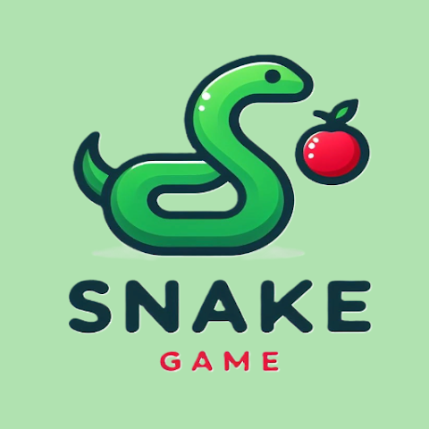
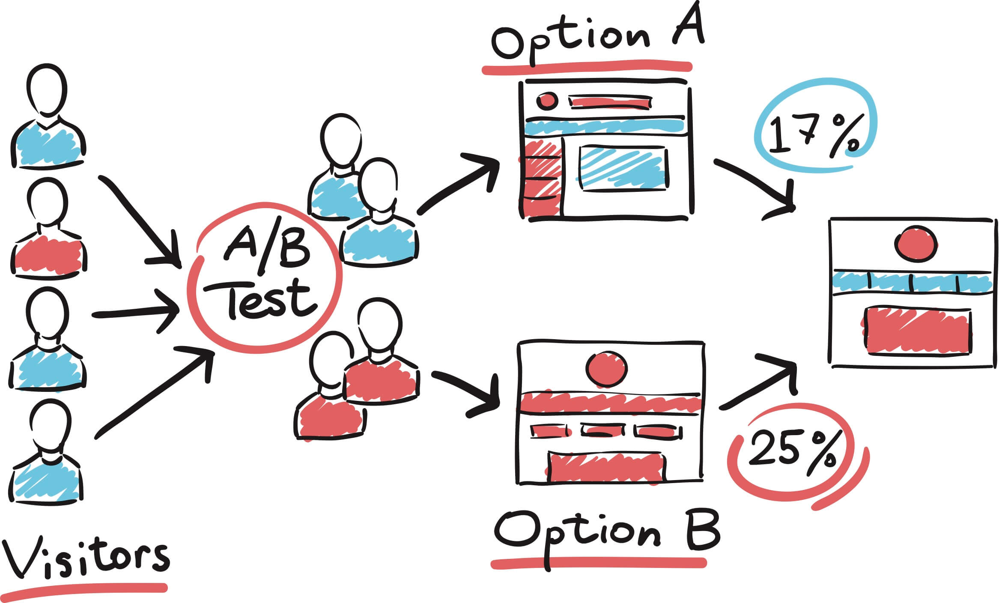

I try to stay busy learning new skills and the best way to do that is to make something. These are my projects that I am working on or have finished. The goal would be to have this list filled with projects that could help others learn the same skills!

<table>
    <thead>
        <tr>
            <th>Logo</th>
            <th>Title</th>
            <th>Description</th>
            <th>Link</th>
        </tr>
    </thead>
    <tbody>
         <tr>
            <td></td>
            <td>Snake</td>
            <td>An attempt to make the snake game using pygame.</td>
            <td><a target="_blank" href="https://github.com/emkhalidi/snake-game">repo</a></td>
        </tr>
        <tr>
            <td></td>
            <td>Customer Segmentation</td>
            <td>Exploring customer segmentation through the application of both k-means clustering and DBSCAN techniques.</td>
            <td><a target="_blank" href="https://github.com/emkhalidi/customer-segmentation">repo</a></td>
        </tr>
         <tr>
            <td></td>
            <td>A/B testing</td>
            <td>A step-by-step guide of how to design and analyse an A/B test experiment in Python.</td>
            <td><a target="_blank" href="https://github.com/emkhalidi/ab-testing-new-webpage-design/">repo</a></td>
        </tr>
    </tbody>
</table>
